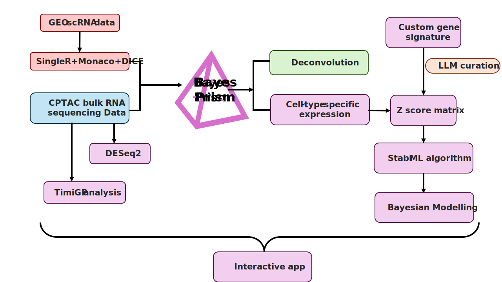

# Obesity and the PDAC Immune Microenvironment

This repository contains the full analysis pipeline for a study examining how body mass index (BMI) shapes the immune and stromal microenvironment of pancreatic ductal adenocarcinoma (PDAC). Bulk RNA-seq, single-cell deconvolution, Bayesian modelling, and immune signature analysis are combined to characterise BMI-associated transcriptomic changes across 140 CPTAC-PDAC patients stratified into normal-weight, overweight, and obese groups.

An interactive signature browser is available at [obese-pdac-model.streamlit.app](https://obese-pdac-model.streamlit.app).

**Methodology**

---

## Patient Cohort

| BMI Group     | BMI Range       | n   |
| ------------- | --------------- | --- |
| Normal weight | 18.5–24.9 kg/m² | 51  |
| Overweight    | 25.0–29.9 kg/m² | 58  |
| Obese         | ≥ 30.0 kg/m²    | 18  |

Data source: CPTAC-PDAC primary tumours via GDC (`TCGAbiolinks`), raw STAR count matrices.

---

## Repository Structure

| Directory                                                                                      | Purpose                                                          |
| ---------------------------------------------------------------------------------------------- | ---------------------------------------------------------------- |
| [`00_data_acquisition/`](00_data_acquisition/)                                                 | Data download and preprocessing of CPTAC/TCGA PDAC RNA-seq data  |
| [`01_bulk_transcriptomics_analysis/`](01_bulk_transcriptomics_analysis/)                       | Differential expression, GSEA, ssGSEA, and KEGG pathway analysis |
| [`02_single_cell_reference_and_deconvolution/`](02_single_cell_reference_and_deconvolution/)   | scRNA-seq reference construction and BayesPrism deconvolution    |
| [`03_LLM_signature_curation_with/`](03_LLM_signature_curation_with/)                           | LLM-assisted immune gene signature curation                      |
| [`04_zscore_normalization_and_stabl_selection/`](04_zscore_normalization_and_stabl_selection/) | Signature scoring and STABL feature selection                    |
| [`05_modeling/`](05_modeling/)                                                                 | Bayesian modelling (categorical, continuous, and comparison)     |
| [`06_timigp/`](06_timigp/)                                                                     | Immune cell–cell interaction network analysis                    |

---

## Analysis Overview

### 1. Data Acquisition ([`00_data_acquisition/`](00_data_acquisition/))

RNA-seq count data were retrieved from CPTAC-PDAC via the GDC portal using `TCGAbiolinks`. Raw STAR count matrices were used as input for downstream analyses.

---

### 2. Bulk RNA-seq ([`01_bulk_transcriptomics_analysis/`](01_bulk_transcriptomics_analysis/))

Raw counts were processed with DESeq2 across three pairwise contrasts (overweight vs. normal, obese vs. normal, obese vs. overweight). Ensembl IDs were converted to HGNC symbols.

Pathway enrichment was performed using clusterProfiler with DESeq2 Wald statistics as the ranking metric, covering GO, KEGG, Reactome, and MSigDB gene sets. KEGG pathways were visualised using Pathview.

Single-sample GSEA (ssGSEA) was performed using ImmPort immune gene signatures on VST-normalised data. Statistical testing included Kruskal-Wallis followed by Dunn’s post-hoc test with BH correction.

Volcano plots and heatmaps were generated for visualisation of differential expression results.

---

### 3. Single-Cell Deconvolution ([`02_single_cell_reference_and_deconvolution/`](02_single_cell_reference_and_deconvolution/))

Two scRNA-seq reference atlases were constructed:

- CD45+ immune reference (GSE235452), annotated using SingleR with manual refinement of macrophage and T cell states
- Whole-tumour non-immune reference (GSE242230), including malignant, stromal, and epithelial compartments

BayesPrism deconvolution was applied to bulk RNA-seq data in multiple stages: immune coarse, immune fine, and non-immune compartments.

---

### 4. Signature Curation ([`03_LLM_signature_curation_with/`](03_LLM_signature_curation_with/))

A custom immune gene signature database (2,143 signatures across 65 cell types) was curated using Google Gemini with mandatory human review.

Deduplication removed redundant signatures using an overlap coefficient threshold (> 0.50). A discovery phase introduced biologically relevant signatures specific to obesity-induced dysfunction in PDAC (8–12 genes, < 20% overlap with existing signatures).

---

### 5. Signature Scoring and Feature Selection ([`04_zscore_normalization_and_stabl_selection/`](04_zscore_normalization_and_stabl_selection/))

Immune signature scores were computed by z-scoring gene expression across samples and averaging within each signature (winsorized at ±3; minimum 4 genes per signature).

STABL feature selection was applied in both categorical (L1 logistic regression) and continuous (Lasso) modes to identify BMI-associated signatures.

---

### 6. Bayesian Modelling ([`05_modeling/`](05_modeling/))

Two complementary hierarchical Bayesian models were implemented in PyMC:

- **Continuous model**: Estimates BMI-associated slopes per feature using partial pooling
- **Categorical model**: Estimates group effects (overweight and obese relative to normal-weight)

Sampling was performed using NUTS (4 chains, 2,000 draws, target acceptance = 0.99). Credibility was assessed using 95% highest density intervals (HDI), and practical significance was evaluated using ROPE thresholds.

A separate module compares continuous and categorical model outputs.

---

### 7. Immune Interaction Networks ([`06_timigp/`](06_timigp/))

The TimiGP framework was applied to infer immune cell–cell interactions from bulk RNA-seq data (normal-weight and overweight groups).

Cox regression identified prognostic gene pairs, and permutation-based FDR (100 iterations) was used to construct interaction networks. Cell-type interaction favourability scores were computed.

---

## Key Parameters

| Analysis        | Key Parameters                                                   |
| --------------- | ---------------------------------------------------------------- |
| DESeq2          | Design: `~ condition`                                            |
| GSEA            | Ranked by Wald stat; minGSSize = 10, maxGSSize = 500, FDR < 0.05 |
| ssGSEA          | VST input; Kruskal-Wallis + Dunn BH; adj.p < 0.05                |
| BayesPrism      | chain.length = 2,000; burn.in = 500; thinning = 2                |
| STABL           | 500 bootstraps; sample_fraction = 0.5; knockoff FDR; 8 seeds     |
| Bayesian models | NUTS; 4 chains; 2,000 draws; target acceptance = 0.99            |
| Convergence     | R-hat < 1.01; ESS > 400                                          |

---
