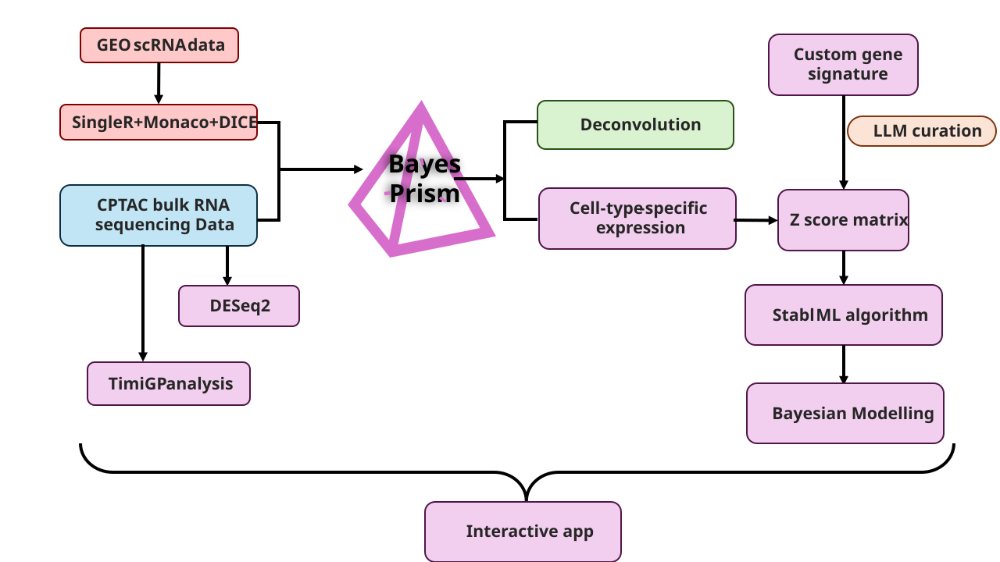
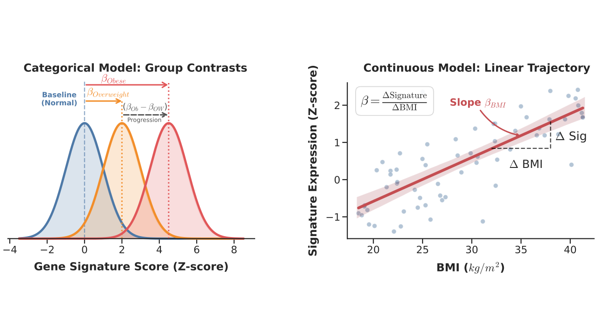

# Obesity-Driven Pancreatic Cancer: A Machine Learning Based Bayesian Model and Interactome analysis

This repository contains the full analysis pipeline for a study examining how body mass index (BMI) shapes the immune and stromal microenvironment of pancreatic ductal adenocarcinoma (PDAC). Bulk RNA-seq, single-cell deconvolution, Bayesian modelling, and immune signature analysis are combined to characterise BMI-associated transcriptomic changes across 140 CPTAC-PDAC patients stratified into normal-weight, overweight, and obese groups.

An interactive signature browser is available at [obese-pdac-model.streamlit.app](https://obese-pdac-model.streamlit.app).

  
   
  <strong>Figure 1. </strong> Abstract illustration

 
*Citation details will be provided upon publication of the associated manuscript. Interim DOI to cite the repo is*    
## Methodology

  
   
  <strong>Figure 2. Methodology.</strong> A multi-resolution computational workflow examining how body mass index (BMI) shapes the tumor microenvironment (TME) in pancreatic ductal adenocarcinoma (PDAC). The pipeline integrates BMI-stratified patient cohorts with layered analytical modules to resolve immune, and stromal across obesity-associated PDAC subtypes.

## Patient Cohort

| BMI Group     | BMI Range       | n   |
| ------------- | --------------- | --- |
| Normal weight | 18.5–24.9 kg/m² | 51  |
| Overweight    | 25.0–29.9 kg/m² | 58  |
| Obese         | ≥ 30.0 kg/m²    | 18  |

Data source: CPTAC-PDAC primary tumours via GDC (`TCGAbiolinks`), raw STAR count matrices.

---

## Repository Structure

| Directory                                                                                      | Purpose                                                          |
| ---------------------------------------------------------------------------------------------- | ---------------------------------------------------------------- |
| [`00_data_acquisition/`](00_data_acquisition/)                                                 | Data download and preprocessing of CPTAC/TCGA PDAC RNA-seq data  |
| [`01_bulk_transcriptomics_analysis/`](01_bulk_transcriptomics_analysis/)                       | Differential expression, GSEA, ssGSEA, and KEGG pathway analysis |
| [`02_single_cell_reference_and_deconvolution/`](02_single_cell_reference_and_deconvolution/)   | scRNA-seq reference construction and BayesPrism deconvolution    |
| [`03_LLM_signature_curation_with/`](03_LLM_signature_curation_with/)                           | LLM-assisted immune gene signature curation                      |
| [`04_zscore_normalization_and_stabl_selection/`](04_zscore_normalization_and_stabl_selection/) | Signature scoring and STABL feature selection                    |
| [`05_modeling/`](05_modeling/)                                                                 | Bayesian modelling (categorical, continuous, and comparison)     |
| [`06_timigp/`](06_timigp/)                                                                     | Immune cell–cell interaction network analysis                    |
| [`07_gigaTIME/`](07_gigaTIME/)                                                                 | GigaTIME virtual mIF and figures   |

---

## Analysis Overview

### 1. Data Acquisition ([`00_data_acquisition/`](00_data_acquisition/))

RNA-seq count data were retrieved from CPTAC-PDAC via the GDC portal using `TCGAbiolinks`. Raw STAR count matrices were used as input for downstream analyses.

---

### 2. Bulk RNA-seq ([`01_bulk_transcriptomics_analysis/`](01_bulk_transcriptomics_analysis/))

Raw counts were processed with DESeq2 across three pairwise contrasts (overweight vs. normal, obese vs. normal, obese vs. overweight). Ensembl IDs were converted to HGNC symbols.

Pathway enrichment was performed using clusterProfiler with DESeq2 Wald statistics as the ranking metric, covering GO, KEGG, Reactome, and MSigDB gene sets. KEGG pathways were visualised using Pathview.

Single-sample GSEA (ssGSEA) was performed using ImmPort immune gene signatures on VST-normalised data. Statistical testing included Kruskal-Wallis followed by Dunn's post-hoc test with BH correction.

Volcano plots and heatmaps were generated for visualisation of differential expression results.

---

### 3. Single-Cell Deconvolution ([`02_single_cell_reference_and_deconvolution/`](02_single_cell_reference_and_deconvolution/))

Two scRNA-seq reference atlases were constructed:

- CD45+ immune reference (GSE235452), annotated using SingleR with manual refinement of macrophage and T cell states
- Whole-tumour non-immune reference (GSE242230), including malignant, stromal, and epithelial compartments

BayesPrism deconvolution was applied to bulk RNA-seq data in multiple stages: immune coarse, immune fine, and non-immune compartments.

---

### 4. Signature Curation ([`03_LLM_signature_curation_with/`](03_LLM_signature_curation_with/))

A custom immune gene signature database (2,143 signatures across 65 cell types) was curated using Google Gemini with mandatory human review.

Deduplication removed redundant signatures using an overlap coefficient threshold (> 0.50). A discovery phase introduced biologically relevant signatures specific to obesity-induced dysfunction in PDAC (8–12 genes, < 20% overlap with existing signatures).

---

### 5. Signature Scoring and Feature Selection ([`04_zscore_normalization_and_stabl_selection/`](04_zscore_normalization_and_stabl_selection/))

Immune signature scores were computed by z-scoring gene expression across samples and averaging within each signature (winsorized at ±3; minimum 4 genes per signature).

STABL feature selection was applied in both categorical (L1 logistic regression) and continuous (Lasso) modes to identify BMI-associated signatures.

---

### 6. Bayesian Modelling ([`05_modeling/`](05_modeling/))

Two complementary hierarchical Bayesian models were implemented in PyMC to quantify the magnitude and uncertainty of BMI-associated cellular changes, with partial pooling to share information across biologically related features within each cell type.

#### Categorical Model

Captures non-linear associations across BMI groups (Normal, Overweight, Obese). The expected signature expression $\mu_{ij}$ is modelled as:

$$\mu_{ij} = \alpha_j + \gamma_{p[i]} + \beta^{\text{Overweight}}_{kj} \cdot \mathbf{I}(BMI_i \in \text{Overweight}) + \beta^{\text{Obese}}_{kj} \cdot \mathbf{I}(BMI_i \in \text{Obese})$$

where $\mathbf{I}$ is the indicator function, $\alpha_j$ is the baseline signature expression for normal-weight individuals, $\beta^{\text{Overweight}}_{kj}$ is the effect of overweight relative to normal, and $\beta^{\text{Obese}}_{kj}$ is the effect of obesity relative to normal.

#### Continuous Model

Estimates the linear slope of signature change per standardised unit of BMI:

$$\mu_{ij} = \alpha_j + \gamma_{p[i]} + \beta^{\text{Slope}}_{kj} \cdot BMI_{\text{std},i}$$

where $\beta^{\text{Slope}}_{kj}$ is the change in signature per unit change in BMI, $BMI_{\text{std},i}$ is the standardised BMI, and $\alpha_j$ is the expected signature expression at average BMI.

#### Patient-Level Random Intercept

To account for the repeated-measures structure (each patient contributes one observation per signature across multiple cell types), a patient-level random intercept $\gamma_{p[i]}$ is incorporated into both models using non-centred parameterisation:

$$\gamma_p = \gamma^*_p \cdot \sigma_{\text{patient}}, \quad \gamma^*_p \sim \mathcal{N}(0, 1), \quad \sigma_{\text{patient}} \sim \text{HalfNormal}(0.50)$$

This term partitions systematic between-patient baseline variation from BMI-associated effects, preventing pseudoreplication from inflating posterior certainty.

#### Hierarchical Prior Specification

Regularising priors were applied to reduce overfitting, with scales specified per compartment to reflect differences in signal magnitude:

| Compartment   | `celltype_sigma` | `feature_sigma` | `patient_sigma` | `baseline_sigma` | `obs_sigma` |
| ------------- | :--------------: | :-------------: | :-------------: | :--------------: | :---------: |
| Non-Immune    | 0.20             | 0.30            | 0.50            | 1.5              | 1.0         |
| Immune Coarse | 0.25             | 0.40            | 0.50            | 1.5              | 1.0         |
| Immune Fine   | 0.18             | 0.28            | 0.50            | 1.5              | 1.0         |

#### Inference and Convergence

Posterior distributions were approximated using the No-U-Turn Sampler (NUTS) in PyMC (4 chains, 2,000 tuning steps, 2,000 sampling draws, target acceptance = 0.99). Convergence was assessed using the Gelman–Rubin statistic ($\hat{R} < 1.01$) and effective sample size (ESS > 400), with diagnostics computed using ArviZ.

#### Credibility and Practical Significance

- **Statistical credibility (○):** 95% Highest Density Interval (HDI) strictly excludes zero.
- **Moderate practical significance (★):** HDI excludes zero and > 95% of the posterior falls outside a ROPE of ±0.1 (categorical) or ±0.01 (continuous).
- **Strong practical significance (★★):** HDI excludes zero and > 95% of the posterior falls outside a ROPE of ±0.2 (categorical) or ±0.02 (continuous).

A separate module compares continuous and categorical model outputs.

  
   
  
  <strong>Figure 3. Bayesian hierarchical modeling.</strong>
  (A) <strong>Categorical Model:</strong> Posterior distributions of mean signature expression (Z-score)
  across Normal (blue), Overweight (orange), and Obese (red) cohorts. Regression coefficients (β)
  denote effect sizes relative to Normal; dashed arrow indicates the derived contrast
  (βObese − βOverweight).
  (B) <strong>Continuous Model:</strong> Linear regression of signature expression against BMI (kg/m²).
  The slope (βBMI) quantifies directional association strength (ΔSignature/ΔBMI).
  Shaded regions represent the 95% Highest Density Interval (HDI).
  

---

### 7. Immune Interaction Networks ([`06_timigp/`](06_timigp/))

The TimiGP framework was applied to infer immune cell–cell interactions from bulk RNA-seq data (normal-weight and overweight groups).

Cox regression identified prognostic gene pairs, and permutation-based FDR (100 iterations) was used to construct interaction networks. Cell-type interaction favourability scores were computed.

---

### 8. GigaTIME Virtual Spatial Proteomics ([`07_gigaTIME/`](07_gigaTIME/))

GigaTIME was applied to whole-slide H&E images from the CPTAC-PDAC cohort (a totlat of 168 patients) to generate virtual multiplexed immunofluorescence (mIF) maps across 21 protein markers (PD-1, CD14, CD4, T-bet, CD34, CD68, CD16, CD11c, CD138, CD20, CD3, CD8, PD-L1, CK, Ki67, Tryptase, Actin-D, Caspase3-D, PHH3-B, Transgelin, DAPI).

Slides were downloaded from the NCI Imaging Data Commons and quality-controlled via a patch-sampled slide census. Inference used a continuous 256 px sliding window (128 px stride, 50% overlap) with a fast CK probe to select the most tumour-enriched tissue section per patient. Per-patient activation densities and spatial metrics (CD8-to-tumour distance, Transgelin–CD8 Dice overlap, CD11c-to-CD8 distance) were compared across BMI groups using Kruskal-Wallis and pairwise Mann-Whitney U tests with BH correction.

---

## Key Parameters

| Analysis        | Key Parameters                                                   |
| --------------- | ---------------------------------------------------------------- |
| DESeq2          | Design: `~ condition`                                            |
| GSEA            | Ranked by Wald stat; minGSSize = 10, maxGSSize = 500, FDR < 0.05 |
| ssGSEA          | VST input; Kruskal-Wallis + Dunn BH; adj.p < 0.05                |
| [BayesPrism](https://github.com/Danko-Lab/BayesPrism)      | chain.length = 2,000; burn.in = 500; thinning = 2                |
| [STABL](https://github.com/gregbellan/Stabl)           | 500 bootstraps; sample_fraction = 0.5; knockoff FDR; 8 seeds     |
| Bayesian models | NUTS; 4 chains; 2,000 tuning + 2,000 draws; target acceptance = 0.99 |
| Convergence     | $\hat{R}$ < 1.01; ESS > 400                                      |
| [GigaTIME](https://github.com/prov-gigatime/GigaTIME/)        | 256×256-pixel, 128-pixel stride, Kruskal-Wallis + Mann-whitney U test + BH; adj.p < 0.05 |

## Compute Environment

All notebooks were developed and executed in Google Colab.
Notebooks use Colab-specific syntax (`%%R`, `%load_ext rpy2.ipython`)
and `/content/drive/MyDrive/` paths that require adjustment for
local execution. To reproduce analyses, upload notebooks to Colab,
mount Google Drive, and update file paths accordingly. gigaTIME was ran in A-100 GPU with High RAM, rest of the analysis were ran in CPU with high RAM. 

## Data Availability

| Dataset | Accession | Description |
|---------|-----------|-------------|
| CD45+ immune scRNA-seq | GSE235452 (GSM7502530) | Immune reference |
| Whole-tumour scRNA-seq | GSE242230 | Non-immune reference |
| Bulk RNA-seq (CPTAC-PDAC) | Via GDC using TCGAbiolinks | 140 patients |
| Signature database | Zenodo DOI / Streamlit app | 2,143 signatures |
| H&E DICOM images (CPTAC-PDA) | NCI Imaging Data Commons | 168 patients 
---

## Citation

Citation details will be provided upon publication of the associated manuscript.
